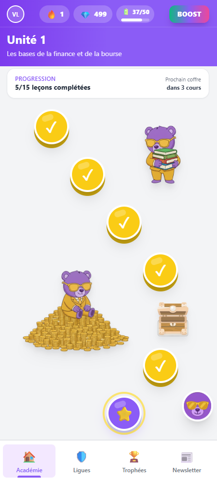
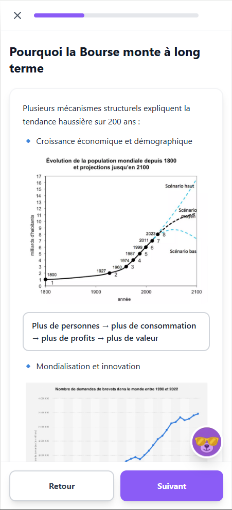
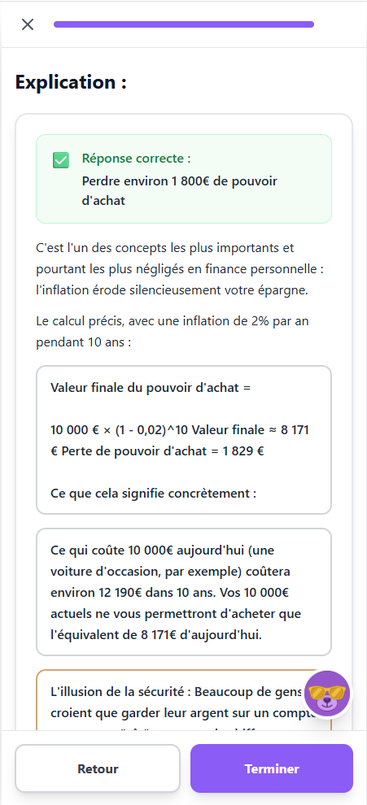
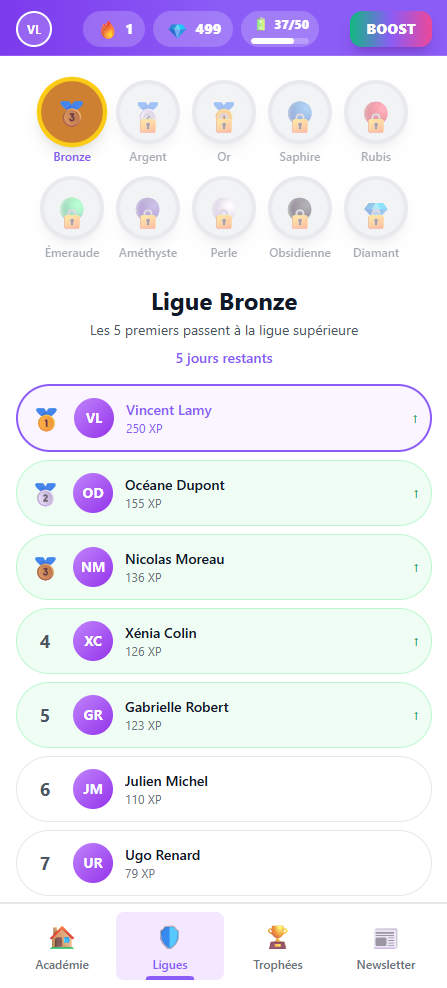
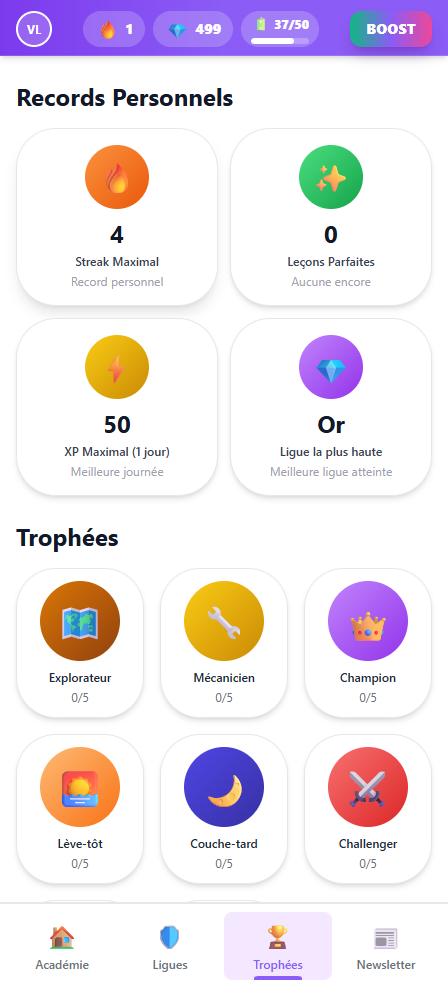
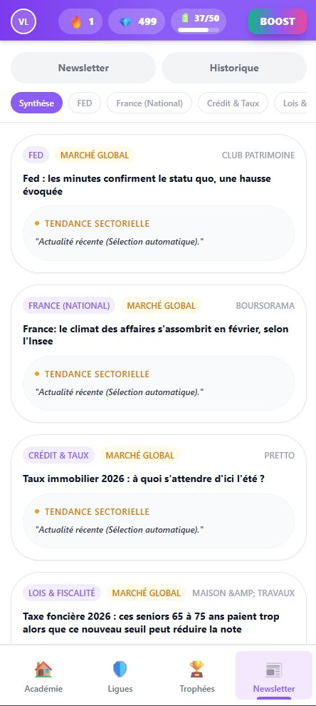
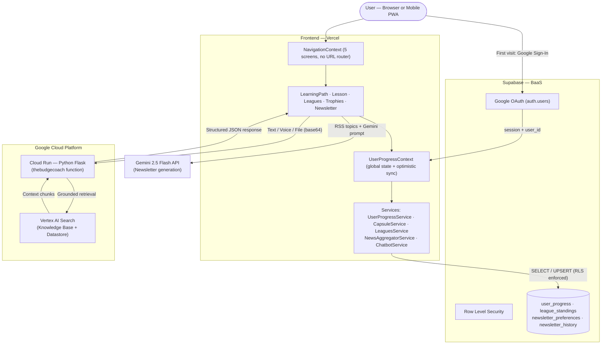
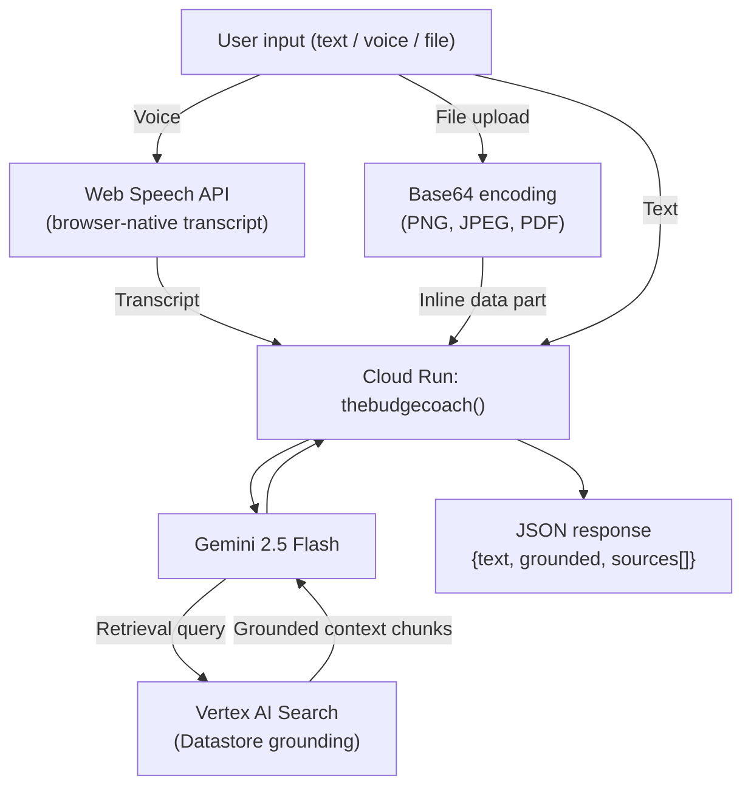
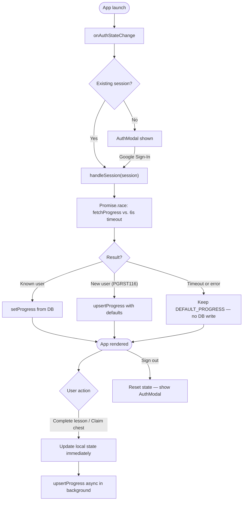
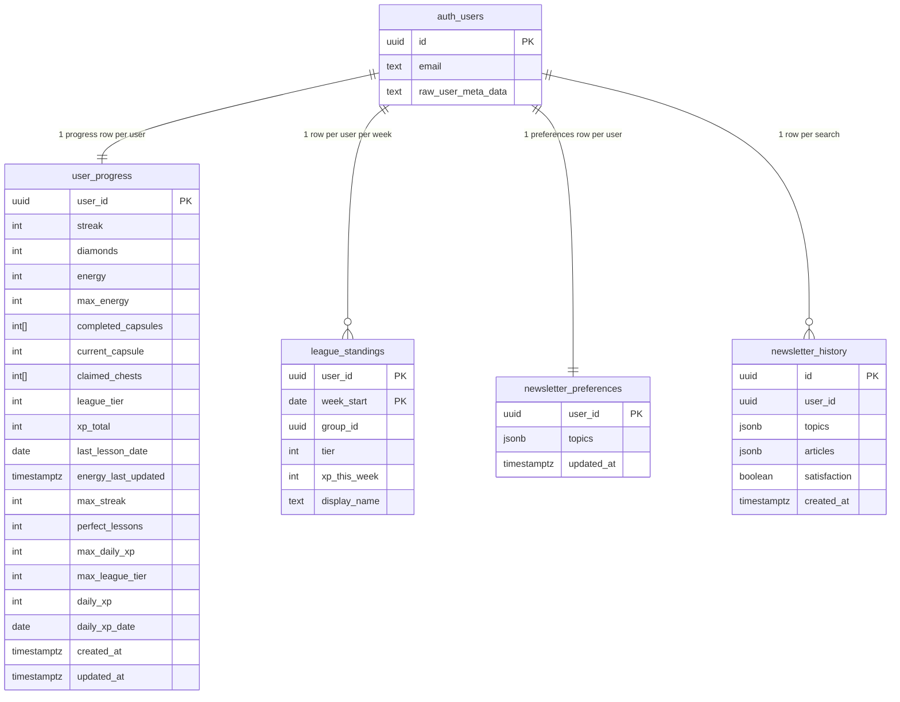

# TheBudge — The Duolingo of Personal Finance

> A mobile-first Progressive Web App that makes financial education engaging for young adults through gamified micro-lessons, an AI-powered RAG chatbot, and a personalized newsletter — built with React 19, Supabase, and Google Cloud.

**Beta Demo Guide:** [Watch on Loom](https://www.loom.com/share/ad04a5f7387b4cd1bc82eabc9237b2af ) · 
**Business Pitch Deck:** [See on Canva](https://www.canva.com/design/DAHCJ2-Qdp0/fjI0nmmF2BWfCOLlgmqC-Q/view?utm_content=DAHCJ2-Qdp0&utm_campaign=designshare&utm_medium=link2&utm_source=uniquelinks&utlId=h9185971e31 ) · 

---

## The Problem

Money is a taboo subject in France. **64% of 15–17 year-olds** want financial education, yet only **56% of French adults** achieve a basic financial literacy score. Meanwhile, 79% of Gen Z gets financial advice from TikTok and Instagram — unverified and potentially misleading.

The global financial wellness market is projected to grow from **$3.8B (2024) to $10.2B (2034)**. TheBudge captures a neglected segment at the intersection of structured education and real-time information, targeting two profiles:

- **The Anxious Explorer** (18–24) — beginner, overwhelmed by financial concepts
- **The Time-Poor Optimizer** (25–39) — professional, wants concise and actionable insights

TheBudge delivers 3-minute capsule lessons (stock market, savings, compound interest, real estate) through a **Duolingo-style engagement loop** — streaks, XP, energy, weekly leagues — to build daily habits. An embedded **RAG chatbot** (Python/Flask on Cloud Run, grounded via Vertex AI Search) answers finance questions with reduced hallucination risk. A **Gemini-generated newsletter** delivers personalized articles based on user-selected topics.

---

## Screenshots

| Academy | Lesson | Quiz correction |
|:---:|:---:|:---:|
|  |  |  |
| Learning path with capsules, chest nodes, and bear mascots | Rich lesson content with embedded charts and data | Detailed correction with formula breakdown after a quiz answer |

| Leagues | Trophies | Newsletter |
|:---:|:---:|:---:|
|  |  |  |
| Bronze league — 10-player leaderboard with promotion rules | Personal records + 6 achievement trophies | AI-curated financial news by topic (FED, real estate, rates…) |

---

## Tech Stack

| Layer | Technology |
|---|---|
| Frontend | React 19, TypeScript, Vite, Tailwind CSS (CDN) |
| State management | React Context API — no external library |
| Routing | State-based navigation via `NavigationContext` (no URL router) |
| Auth | Supabase Google OAuth — `onAuthStateChange` |
| Database | Supabase PostgreSQL + Row Level Security (4 tables) |
| AI Chatbot backend | Python 3, `google-genai` SDK, Google Cloud Run |
| AI model | Gemini 2.5 Flash (default, configurable via `GEMINI_MODEL`) |
| RAG / Knowledge base | Vertex AI Search (Datastore grounding) |
| AI Newsletter | Gemini API — fully client-side via `NewsAggregatorService` |
| News aggregation | RSS feeds + RSS2JSON API |
| Voice input | Web Speech API (browser-native, no backend) |
| Deployment | Vercel (frontend) + Google Cloud Run (backend) |
| PWA | `manifest.json` — installable on Android and iOS |

---

## Architecture



---

## Feature Breakdown

### Learning Path — Capsule Lessons

Lessons are stored as Markdown files in `public/capsules/`. The `CapsuleParser` service processes them using a **custom state machine** that detects block headers via regex, normalizing raw Markdown into structured arrays of educational blocks, quiz questions, and detailed corrections.

```
capsule.md → CapsuleParser → [Block[], Question[], Explanation[]] → LessonScreen cards
```

Updating the curriculum requires only editing a Markdown file — no code deployment. Currently 9 capsules covering: financial markets, savings, compound interest, investing basics, risk management.

### Gamification

| Mechanic | Implementation |
|---|---|
| **Streaks** | Daily counter — persisted in Supabase, reset if a day is skipped |
| **XP & Diamonds** | Earned on lesson completion and chest claims — stored in `xp_total` |
| **Energy** | Pool of 50 by default — each lesson costs 20 energy — recharges 1 unit per 30 minutes |
| **Chest nodes** | Unlocked after completing the preceding capsule — claim idempotent via `claimed_chests[]` |
| **Weekly leagues** | Groups of up to 20 users ranked by weekly XP — top 5 promoted (tier + 1), bottom 3 demoted (tier − 1) |
| **Trophies** | Personal records: best streak, perfect lessons, best daily XP, highest tier reached |

### AI Chatbot — RAG Pipeline

The `TheBudgeAI` assistant runs as a **Python function on Google Cloud Run**. It supports 4 modes triggered contextually from within lessons:

| Mode | Trigger | Behaviour |
|---|---|---|
| `error` | Wrong quiz answer | Explains why the selected answer is wrong, why the correct one is right, generates a follow-up mini-quiz |
| `explain` | "Explain again" button | Rephrases the current lesson block in simpler terms |
| `example` | "Give me an example" button | Produces a concrete real-life analogy for the concept |
| `help` | Free-text input | General finance Q&A, grounded via RAG |



- Voice uses the **native Web Speech API** — zero backend cost
- Files sent as **base64 inline data** — no file storage needed
- **Graceful degradation**: if `DATASTORE_PATH` is unset, runs without RAG. If the Datastore is unreachable, automatically retries without RAG.
- AMF-compliant: system instruction explicitly prohibits investment advice

### AI Newsletter

`NewsAggregatorService` runs entirely **client-side** — no backend required:
1. User selects finance topics (real estate, stock market, trading, crypto…)
2. RSS feeds fetched and converted via RSS2JSON API
3. Gemini generates a personalized summary article per topic
4. Preferences and search history persisted in Supabase

### Auth & Persistence — Supabase + Google OAuth

Google OAuth is **mandatory from first launch**. No anonymous or email access.



**Optimistic sync:** the UI updates immediately; Supabase write happens asynchronously. The `Promise.race` with a 6-second timeout prevents infinite loading — the app falls back to `DEFAULT_PROGRESS` without overwriting existing data.

---

## Data Model

### Entity Relationships



> `league_standings` has a composite PK `(user_id, week_start)`. Multiple rows with the same `group_id` and `week_start` form a league group of up to 20 players.

---

### `user_progress`

One row per user, upserted on `user_id` conflict. Primary persistence layer for the gamification loop.

| Column | Type | Default | Description |
|---|---|---|---|
| `user_id` | `UUID` PK | — | References `auth.users` — stable across devices |
| `streak` | `INTEGER` | `0` | Current daily streak |
| `diamonds` | `INTEGER` | `0` | Accumulated diamonds |
| `energy` | `INTEGER` | `50` | Current energy pool |
| `max_energy` | `INTEGER` | `50` | Energy cap |
| `completed_capsules` | `INTEGER[]` | `{}` | IDs of fully completed capsules |
| `current_capsule` | `INTEGER` | `1` | Pointer to the active capsule |
| `claimed_chests` | `INTEGER[]` | `{}` | Chest indexes already opened (idempotent) |
| `league_tier` | `INTEGER` | `1` | Current league tier (1 = Bronze) |
| `xp_total` | `INTEGER` | `0` | Total XP accumulated across all sessions |
| `last_lesson_date` | `DATE` | `NULL` | Date of last completed lesson (streak logic) |
| `energy_last_updated` | `TIMESTAMPTZ` | `NOW()` | Last energy write — used for recharge computation |
| `max_streak` | `INTEGER` | `0` | Personal best streak |
| `perfect_lessons` | `INTEGER` | `0` | Lessons completed without any wrong answer |
| `max_daily_xp` | `INTEGER` | `0` | Best XP earned in a single day |
| `max_league_tier` | `INTEGER` | `1` | Highest league tier ever reached |
| `daily_xp` | `INTEGER` | `0` | XP earned today (resets daily) |
| `daily_xp_date` | `DATE` | `NULL` | Date the `daily_xp` counter was last reset |
| `created_at` / `updated_at` | `TIMESTAMPTZ` | `NOW()` | `updated_at` auto-managed by trigger on every `UPDATE` |

**RLS:** `SELECT`, `INSERT`, `UPDATE` all require `auth.uid() = user_id`. Deletion cascades from `auth.users`.

---

### `league_standings`

One row per `(user_id, week_start)`. Manages weekly group-based rankings.

| Column | Type | Default | Description |
|---|---|---|---|
| `user_id` | `UUID` | — | References `auth.users` |
| `group_id` | `UUID` | — | Group identifier — rows sharing `(group_id, week_start)` form a league group |
| `week_start` | `DATE` | — | Monday of the current week (partition key) |
| `tier` | `INTEGER` | `1` | League tier for this week — determines which group the user is assigned to |
| `xp_this_week` | `INTEGER` | `0` | XP accumulated this week |
| `display_name` | `TEXT` | `''` | Google display name, shown in the leaderboard |

**Indexes:**
- `idx_league_group` on `(group_id, week_start)` — used by `fetchLeaderboard`
- `idx_league_tier_week` on `(tier, week_start)` — used by `join_or_create_league_group` to find available groups

**SQL functions (RPCs):**

`join_or_create_league_group(p_user_id, p_tier, p_week_start, p_display_name, p_max_size = 20)`
— Atomically assigns the user to the first available group of the same tier, or creates a new one. Runs with `SECURITY DEFINER` to bypass RLS when scanning other users' rows. Protects against concurrent inserts via `ON CONFLICT DO NOTHING`.

`increment_league_xp(p_user_id, p_week_start, p_amount)`
— Atomically increments `xp_this_week` via a single `UPDATE`. Raises a Postgres exception if the row does not exist, making any race condition visible.

**Promotion / demotion logic** (computed by `resolveWeekEnd` in `LeaguesService.ts` at the start of each new week):
- Rank ≤ 5 in final group → **promoted** (`tier + 1`, capped at 10)
- Rank > `total − 3` → **demoted** (`tier − 1`, floored at 1)
- Guard: only applied when `total ≥ 5` (prevents mass demotion in small groups)

**Bot padding:** `padWithBots` in `LeaguesService.ts` completes any group with fewer than 10 real players using deterministic bots (PRNG seeded on `groupId + weekStart`). Bots always rank below the last real player and are never written to the database.

**RLS:** `SELECT` requires the row's `group_id` to match one of the user's own groups. `INSERT` / `UPDATE` limited to own `user_id`.

---

### `newsletter_preferences`

One row per user. Replaces `localStorage` for topic persistence.

| Column | Type | Default | Description |
|---|---|---|---|
| `user_id` | `UUID` PK | — | References `auth.users` |
| `topics` | `JSONB` | `[]` | Array of selected finance topics |
| `updated_at` | `TIMESTAMPTZ` | `NOW()` | Last update timestamp |

---

### `newsletter_history`

Full history of newsletter searches with satisfaction feedback.

| Column | Type | Default | Description |
|---|---|---|---|
| `id` | `UUID` PK | `gen_random_uuid()` | Auto-generated |
| `user_id` | `UUID` | — | References `auth.users` |
| `topics` | `JSONB` | `[]` | Topics requested in this search |
| `articles` | `JSONB` | `[]` | Full generated articles |
| `satisfaction` | `BOOLEAN` | `NULL` | User feedback — `true` = thumbs up, `false` = thumbs down |
| `created_at` | `TIMESTAMPTZ` | `NOW()` | Search timestamp |

**Index:** `idx_newsletter_history_user` on `(user_id, created_at DESC)` — for fetching a user's recent history efficiently.

---

## Backend — API Reference

The Cloud Run backend exposes a **single HTTP endpoint** (the `thebudgecoach` function) at the URL set in `VITE_CLOUD_RUN_URL`.

### POST `/`

**Request body (JSON):**

| Field | Type | Required | Description |
|---|---|---|---|
| `mode` | `string` | No (default: `"help"`) | `"explain"` / `"example"` / `"error"` / `"help"` |
| `message` | `string` | No | Free-text user question |
| `capsuleId` | `string` | No | Active capsule ID (added to prompt context) |
| `blockId` | `string` | No | Active block ID (added to prompt context) |
| `blockText` | `string` | No | Visible lesson text sent as prompt context |
| `quiz` | `object` | Required for `error` mode | `{ question, choices[], selectedIndex, correctIndex }` |
| `files` | `array` | No | List of `{ type, name, data }` — `data` is a base64 data URL (`data:image/png;base64,...`) |

**Response body (JSON):**

| Field | Type | Description |
|---|---|---|
| `text` | `string` | Gemini's response text |
| `grounded` | `boolean` | `true` if Vertex AI Search grounding was used |
| `sourcesCount` | `number` | Number of source chunks retrieved |
| `sources` | `array` | Up to 5 `{ title, uri }` source references |
| `retrievalQueries` | `array` | Queries sent to Vertex AI Search (up to 5, for debugging) |

**CORS:** all origins accepted (`Access-Control-Allow-Origin: *`). Preflight `OPTIONS` returns 204.

**RAG fallback behaviour:**
1. If `DATASTORE_PATH` is not set → request sent to Gemini without RAG tools
2. If `DATASTORE_PATH` is set but the Datastore returns a "not found" error → automatic retry without RAG
3. Any other Gemini error → graceful error message returned in `text` field (no 5xx)

---

## Getting Started

### Prerequisites

- Node.js 18+
- Python 3.11+ (backend only)
- A Supabase project with Google OAuth enabled
- A Gemini API key (`VITE_GEMINI_API_KEY`)
- (Optional) A Google Cloud project with Cloud Run + Vertex AI Search for the RAG chatbot

### Frontend

```bash
git clone https://github.com/Vincent-20-100/TheBudge.git
cd TheBudge
npm install
npm run dev        # http://localhost:3001
```

On Windows, `LANCER_APP_VITE.bat` runs `npm install && npm run dev` automatically.

### Database setup

Run `supabase/schema.sql` once against your Supabase project to create all tables, RLS policies, indexes, and SQL functions:

1. Open **Supabase Dashboard → SQL Editor → New query**
2. Paste the contents of `supabase/schema.sql`
3. Click **Run**

See `supabase/README.md` for the full table reference.

### Backend (Cloud Run)

```bash
cd backend
pip install -r requirements.txt
```

For local testing using the [Functions Framework](https://github.com/GoogleCloudPlatform/functions-framework-python):

```bash
pip install functions-framework
DATASTORE_PATH="projects/YOUR_PROJECT/locations/global/collections/default_collection/dataStores/YOUR_STORE" \
  functions-framework --target=thebudgecoach --port=8080
```

Leave `DATASTORE_PATH` unset to run without RAG. For Cloud Run deployment, see `docs/DEPLOYMENT.md`.

### Environment variables

#### Frontend — `.env.local`

```env
VITE_SUPABASE_URL=https://your-project.supabase.co
VITE_SUPABASE_ANON_KEY=your_supabase_anon_key
VITE_GEMINI_API_KEY=your_gemini_api_key
VITE_CLOUD_RUN_URL=https://your-service-region-project.a.run.app
```

| Variable | Required | Impact if missing |
|---|---|---|
| `VITE_SUPABASE_URL` + `VITE_SUPABASE_ANON_KEY` | Yes | Auth and persistence disabled — app unusable |
| `VITE_GEMINI_API_KEY` | Yes | Newsletter generation disabled |
| `VITE_CLOUD_RUN_URL` | No | Chatbot disabled |

#### Backend — Cloud Run environment variables

| Variable | Required | Default | Description |
|---|---|---|---|
| `DATASTORE_PATH` | No | `None` | Vertex AI Search datastore path — format: `projects/{project}/locations/global/collections/default_collection/dataStores/{id}`. If unset, the chatbot runs without RAG. |
| `GEMINI_MODEL` | No | `gemini-2.5-flash` | Override the Gemini model used by the chatbot. |

### Build for production

```bash
npm run build   # Output in dist/ — ready for Vercel
```

---

## Project Structure

```
TheBudge/
├── src/
│   ├── components/          # AuthModal, Header, ProfileModal, TabBar
│   ├── contexts/            # UserProgressContext (auth + global state + optimistic sync)
│   ├── navigation/          # NavigationContext (5-route state machine, no URL router)
│   ├── screens/             # LearningPathScreen, LessonScreen, LeaguesScreen, TrophiesScreen, NewsletterScreen
│   ├── services/
│   │   ├── CapsuleParser.ts          # Markdown → structured lesson blocks (state machine + regex)
│   │   ├── CapsuleService.ts         # Dynamic capsule loading
│   │   ├── ChatbotService.ts         # Cloud Run API calls
│   │   ├── LeaguesService.ts         # League standings, group assignment, bot padding
│   │   ├── NewsAggregatorService.ts  # RSS + Gemini newsletter generation (client-side)
│   │   ├── NewsletterService.ts      # Newsletter preferences + history (Supabase)
│   │   ├── PhraseService.ts          # Motivational phrases + bear images
│   │   ├── UserProgressService.ts    # fetchProgress / upsertProgress (DB layer)
│   │   └── supabaseClient.ts         # Supabase singleton client
│   ├── utils/               # progressUtils (streak calculation, energy recharge helpers)
│   ├── assets/bears/        # Bear mascot images (Vite static imports)
│   ├── assets/              # chess.png, chess-open.png (LearningPathScreen)
│   ├── types.ts             # Shared TypeScript interfaces
│   ├── App.tsx
│   └── index.tsx
├── backend/
│   ├── main.py              # Cloud Run function — Flask + Gemini RAG chatbot
│   ├── requirements.txt     # google-genai>=1.0.0
│   └── knowledgebase/       # Vertex AI Search source documents
├── public/
│   ├── capsules/            # Lesson Markdown files — capsule1.md … capsule9.md
│   ├── quiz_pause.md        # Motivational phrases shown before quiz sections
│   ├── bear_assets/         # Bear mascot images served as public URLs
│   └── assets/              # Quiz images (Im1.png … Im14.png)
├── supabase/
│   ├── schema.sql           # Full DB schema — tables, RLS policies, indexes, SQL functions
│   └── README.md            # Supabase setup instructions
├── docs/
│   ├── screenshots/         # App screenshots (Academy, Lesson, Leagues, Trophies, Newsletter)
│   ├── DEPLOYMENT.md        # Vercel env vars, Supabase checklist, Cloud Run deploy steps
│   ├── BUG_TO_FIX.md        # Known issues classified by priority (internal)
│   ├── REFACTORING.md       # Repo reorganization log
│   ├── plans/               # Implementation plans (internal dev)
│   ├── GTM visuals/         # Go-to-market visual assets
│   ├── merch/               # Merchandise mockups
│   ├── TheBudge_GTM_Strategy.pdf
│   ├── TheBudge_MVP_demo_&_technical_note.pdf
│   ├── TheBudge_Project_Submission.pdf
│   └── TheBudge_INTERNAL_demo_.mp4
├── .env.local.example
├── LANCER_APP_VITE.bat      # Windows shortcut: npm install && npm run dev
├── index.html
├── manifest.json            # PWA manifest (installable on mobile)
├── package.json
├── tsconfig.json
├── vite.config.ts
└── README.md
```

---

## School Deliverables

All project deliverables are in `docs/`:

| Document | Description |
|---|---|
| `TheBudge_Project_Submission.pdf` | Initial proposal — problem definition, market analysis, competitive benchmark, team composition |
| `TheBudge_GTM_Strategy.pdf` | Go-to-market strategy — personas, business model hypotheses (freemium vs. ecosystem), launch roadmap France → Benelux → Europe |
| `TheBudge_MVP_demo_&_technical_note.pdf` | Technical deep dive — architecture, state machine parser, RAG pipeline, KPIs, investor feedback |
| `TheBudge_INTERNAL_demo_.mp4` | Internal product demo video |

---

## Team

| Name | Company | Role |
|---|---|---|
| Charles Daumesnil ([cdaumesnil@albertschool.com](mailto:cdaumesnil@albertschool.com)) | KPMG | Project Lead — Sales & Marketing |
| Pavel-Dan Diaconu ([pdiaconu@albertschool.com](mailto:pdiaconu@albertschool.com)) | AI Partners | Data Engineer — GCP & AI infrastructure |
| Vincent Lamy ([vlamy@albertschool.com](mailto:vlamy@albertschool.com)) | Total Energies | Financial Expert — Content & curriculum |
| Alexandre Waerniers ([awaerniers@albertschool.com](mailto:awaerniers@albertschool.com)) | Synchrone | Mobile Developer — Frontend architecture |

